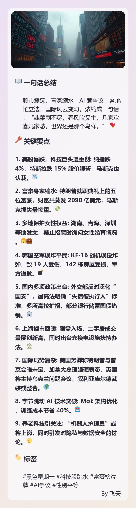

# 📝 Text2Card Project Documentation

[English](./README_EN.md) | [中文](./README.md)

## ✅ Introduction
Text2Card is an elegant tool designed to convert text content into beautiful image cards. Unlike screenshot methods using headless browsers, Text2Card is lightweight, independent of external services, and generates images directly through function calls, making it highly efficient and easy to integrate. Now with OpenAI API compatibility, it can be seamlessly integrated into various AI applications.

## 🙏 Acknowledgment
This project is a modified version based on [@LargeCupPanda/Text2Card](https://github.com/LargeCupPanda/Text2Card). We express our sincere gratitude to the original author for their open-source contribution!

## 🚀 Features
- **Ready-to-Use**: Simplified configuration, no complex setup required, quick deployment.
- **OpenAI API Compatible**: Supports standard OpenAI API format calls for easy integration.
- **Streaming Support**: Compatible with OpenAI streaming responses for better LLM client compatibility.
- **Auto Image Detection**: Automatically detects URL format content as title images, simplifying API calls.
- **Secure Authentication**: Token-based image access control with API key authentication.
- **Multiple Theme Colors**: Supports various gradient background colors for diverse card styles.
- **Markdown Parsing**: Supports basic Markdown syntax parsing, including headers and lists.
- **Auto Day/Night Mode**: Automatically switches between day and night modes based on time.
- **Image Titles**: Supports adding image titles at the top of cards.
- **Emoji Rendering**: Correctly renders and displays emoji characters.
- **High-Quality Output**: Generates high-resolution images suitable for sharing.
- **Auto Cleanup**: Periodically cleans expired image files.

## 🖼️ Example Showcase
Here's an example of an image generated using Text2Card:

(Note: The above image demonstrates the card effect generated by Text2Card.)

## 🛠️ Installation

### 1. Clone the Repository
```bash
git clone https://github.com/sofs2005/text2card.git
cd text2card
```

### 2. Environment Configuration
Create a `.env` file and set the necessary environment variables:
```plaintext
# Server Configuration
HOST=http://127.0.0.1:3000  # Server base URL, e.g., http://your-server-ip:3000
PORT=3000                   # Server listening port

# Security Configuration
# If not set, the system will automatically generate a random key
# SECRET_KEY=your-secret-key

# API keys list in JSON format, e.g., ["key1", "key2"]
# When empty, no API key will pass validation
API_KEYS=["your-api-key"]

# Image URL token expiry time (seconds)
TOKEN_EXPIRY=3600

# Storage Configuration
UPLOAD_FOLDER=picture       # Image storage directory
MAX_CONTENT_LENGTH=10485760 # Maximum request size, default 10MB

# Logging Configuration
LOG_LEVEL=INFO              # Log level: DEBUG, INFO, WARNING, ERROR, CRITICAL
LOG_FORMAT=%(asctime)s - %(levelname)s - %(message)s

# Image Generation Configuration
SIGNATURE_TEXT=—By 飞天     # Image signature text, will be automatically right-aligned
```

### 3. Install Dependencies
```bash
python3 -m venv venv
source venv/bin/activate  # Windows: venv\Scripts\activate
pip install -r requirements.txt
```

### 4. Font File Preparation
Ensure the following font files are present in the project root directory:
- `msyh.ttc` (Microsoft YaHei Regular)
- `msyhbd.ttc` (Microsoft YaHei Bold)
- `TwitterColorEmoji.ttf` (Color Emoji Font)

## 📡 API Usage Guide

### OpenAI Format Call
```python
import requests

def generate_card(text, api_key):
    url = "http://127.0.0.1:3000/v1/chat/completions"
    headers = {
        "Authorization": f"Bearer {api_key}",
        "Content-Type": "application/json"
    }
    data = {
        "model": "Text2Card",
        "messages": [
            {
                "role": "user",
                "content": text
            }
        ]
    }
    response = requests.post(url, headers=headers, json=data)
    return response.json()

# Usage Example
result = generate_card("Text to convert", "your-api-key")
print(result)
```

### Using Streaming Responses
```python
import requests
import json

def generate_card_streaming(text, api_key):
    url = "http://127.0.0.1:3000/v1/chat/completions"
    headers = {
        "Authorization": f"Bearer {api_key}",
        "Content-Type": "application/json"
    }
    data = {
        "model": "Text2Card",
        "messages": [
            {
                "role": "user",
                "content": text
            }
        ],
        "stream": True  # Enable streaming responses
    }
    
    response = requests.post(url, headers=headers, json=data, stream=True)
    
    for line in response.iter_lines():
        if line:
            line = line.decode('utf-8')
            if line.startswith('data: ') and not line.endswith('[DONE]'):
                chunk = json.loads(line[6:])  # Remove "data: " prefix
                if 'choices' in chunk and chunk['choices']:
                    delta = chunk['choices'][0].get('delta', {})
                    if 'content' in delta:
                        # Process content chunk
                        print(f"Received content: {delta['content']}")
```

### Using Image URL in Content
```python
def generate_card_with_url_content(api_key):
    """Directly add an image URL in the content, which will be automatically detected as a title image"""
    url = "http://127.0.0.1:3000/v1/chat/completions"
    headers = {
        "Authorization": f"Bearer {api_key}",
        "Content-Type": "application/json"
    }
    # Add image URL at the beginning of content for automatic detection
    content = "https://example.com/image.jpg\nThis is the card's main content"
    data = {
        "model": "Text2Card",
        "messages": [
            {
                "role": "user", 
                "content": content
            }
        ]
    }
    response = requests.post(url, headers=headers, json=data)
    return response.json()
```

### Setting Response Format
```python
def generate_card_with_format(text, api_key, format_type="text"):
    """Specify response format, options are 'text' or 'json_object'"""
    url = "http://127.0.0.1:3000/v1/chat/completions"
    headers = {
        "Authorization": f"Bearer {api_key}",
        "Content-Type": "application/json"
    }
    data = {
        "model": "Text2Card",
        "messages": [
            {
                "role": "user",
                "content": text
            }
        ],
        "response_format": {"type": format_type}
    }
    response = requests.post(url, headers=headers, json=data)
    return response.json()
```

### Call with Image Title
```python
def generate_card_with_image(text, image_url, api_key):
    url = "http://127.0.0.1:3000/v1/chat/completions"
    headers = {
        "Authorization": f"Bearer {api_key}",
        "Content-Type": "application/json"
    }
    data = {
        "model": "Text2Card",
        "messages": [
            {
                "role": "user",
                "content": text,
                "title_image": image_url
            }
        ]
    }
    response = requests.post(url, headers=headers, json=data)
    return response.json()
```

### Response Format
#### Standard Response
```json
{
    "id": "text2card-1234567890",
    "object": "chat.completion",
    "created": 1234567890,
    "model": "Text2Card",
    "choices": [{
        "index": 0,
        "message": {
            "role": "assistant",
            "content": ""
        },
        "finish_reason": "stop"
    }],
    "usage": {
        "prompt_tokens": 10,
        "completion_tokens": 20,
        "total_tokens": 30
    }
}
```

#### Streaming Response Example
```json
data: {"id":"text2card-1234567890","object":"chat.completion.chunk","created":1234567890,"model":"Text2Card","choices":[{"index":0,"delta":{"role":"assistant"},"finish_reason":null}]}

data: {"id":"text2card-1234567890","object":"chat.completion.chunk","created":1234567890,"model":"Text2Card","choices":[{"index":0,"delta":{"content":""},"finish_reason":null}]}

data: {"id":"text2card-1234567890","object":"chat.completion.chunk","created":1234567890,"model":"Text2Card","choices":[{"index":0,"delta":{},"finish_reason":"stop"}]}

data: [DONE]
```

## �� Project Structure
```
text2card/
├── assets/
│   └── example_card.png    # Example image
├── image_generator.py      # Image generation logic
├── app.py                  # API server implementation
├── config.py              # Configuration management
├── .env                   # Environment variables
├── requirements.txt       # Dependencies
├── msyh.ttc              # Microsoft YaHei Regular font
├── msyhbd.ttc            # Microsoft YaHei Bold font
├── TwitterColorEmoji.ttf # Color emoji font
└── README.md             # Project documentation
```

## 🔐 Security Notes
- API Key Authentication: All requests require API key authentication
- URL Token: Image access uses temporary tokens for enhanced security
- File Cleanup: Automatically cleans expired files to prevent storage buildup
- Automatic Key Generation: No need to manually set security keys, system generates them automatically

## 🤝 Contributing
If you have any suggestions or discover issues, please feel free to submit an Issue or Pull Request. Community contributions are highly welcome!

## 📄 License
This project is licensed under the MIT License. See the [LICENSE](LICENSE) file for details.

---
We hope this tool helps you easily generate beautiful image cards! If you have any questions or suggestions, feel free to reach out. 🎉